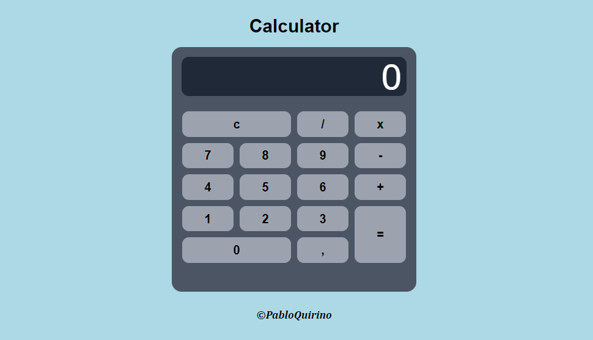

# Calculadora
 Esse projeto é minha primeira calculadora para praticar conceitos básicos de Javascript, por exemplo, utilizar onclick para adicionar funções com parâmetros(números, funções e propriedades da calculadora), tratamento de erro com try-catch e método eval() para efetuar operações.
 
 ### Tecnologias utilizadas:

 - Html
 - Tailwindcss
 - Javascript

 ### Veja o site aqui:
https://pabloquirino.github.io/Calculator/src/

### Captura de tela:
  

